# 🔐 Authentication Module - Deep Audit Report

**Date:** 2026-01-14  
**Auditor:** AI Security Architect  
**Scope:** Login Flow Inconsistency Analysis  
**Status:** 🔴 Critical Issues Found

---

## Executive Summary

This micro-audit analyzes the authentication module's reported failures:
1. Backend returns **HTTP 201 Created** instead of expected **200 OK**
2. Response **Content-Length of 640 bytes** is unusually large
3. Frontend shows **"Login failed"** despite successful 2xx status

After thorough code analysis, the following root causes and security vulnerabilities have been identified.

---

## 1. Root Cause Analysis (RCA)

### 🔴 Problem 1: HTTP Status Code - 201 Instead of 200

| Aspect | Finding |
|--------|---------|
| **Location** | [auth.controller.ts](file:///c:/Users/User/Desktop/rga-dashboard-main/backend/src/modules/auth/auth.controller.ts#L18-L22) |
| **Root Cause** | NestJS `@Post()` decorator defaults to HTTP 201 Created |
| **Missing** | `@HttpCode(HttpStatus.OK)` decorator on login endpoint |

#### Code Evidence

```typescript
// auth.controller.ts (Lines 18-22)
@Post('login')                                    // ❌ Defaults to 201 Created
@ApiOperation({ summary: 'Login with brute force protection' })
login(@Body() dto: LoginDto, @Req() request: Request) {
  return this.authService.login(dto, request);
}
```

#### NestJS Default Behavior
Per NestJS documentation, `@Post()` returns **201 Created** by default. This is semantically correct for resource creation (like [register](file:///c:/Users/User/Desktop/rga-dashboard-main/frontend/src/stores/auth-store.ts#104-131)), but **incorrect for login** which is an authentication operation, not resource creation.

#### Contract Violation
| Endpoint | Expected Status | Actual Status | Semantic Meaning |
|----------|-----------------|---------------|------------------|
| `POST /auth/register` | 201 Created | 201 Created ✅ | Creates user resource |
| `POST /auth/login` | 200 OK | 201 Created ❌ | Authenticates - no resource created |
| `POST /auth/refresh` | 200 OK | 201 Created ❌ | Rotates token - no resource created |

---

### 🟡 Problem 2: Frontend "Login Failed" Alert - Contract Mismatch Analysis

| Aspect | Finding |
|--------|---------|
| **Location** | [auth-store.ts](file:///c:/Users/User/Desktop/rga-dashboard-main/frontend/src/stores/auth-store.ts#L63-L102) |
| **Guard Logic** | Does NOT check for `status === 200` specifically |
| **Actual Trigger** | Exception thrown when extracting `response.data.data` |

#### Code Evidence

```typescript
// auth-store.ts (Lines 71-72)
// ✅ Sprint 4 Standard: Extract from response.data.data
const { accessToken, refreshToken, user } = response.data.data;
```

#### Analysis

The frontend **does NOT explicitly check HTTP status codes**. Instead:

1. **api-client.ts** has a response interceptor that auto-unwraps:
   ```typescript
   // If backend says success: false, reject
   if (!responseData.success) {
     const errorMessage = responseData.message || responseData.error || 'API Error';
     return Promise.reject(new Error(errorMessage));
   }
   // Unwrap: response.data = responseData.data
   response.data = responseData.data;
   ```

2. The "Login failed" error is **NOT triggered by status code 201**.

3. **Possible causes of "Login failed":**
   - Backend response structure doesn't match `{ success: true, data: {...} }`
   - Destructuring `{ accessToken, refreshToken, user }` fails on malformed data
   - Network error or timeout

> [!IMPORTANT]
> The 201 status code is **not the direct cause** of the "Login failed" alert.
> The issue lies in **either the response structure or destructuring logic**.

---

## 2. Payload Analysis (640 Bytes)

### Expected vs Actual Response Structure

#### Expected Login Response (after interceptor unwrap):
```json
{
  "accessToken": "eyJhbGciOiJIUzI1NiIsInR5cCI6IkpXVCJ9...",
  "refreshToken": "eyJhbGciOiJIUzI1NiIsInR5cCI6IkpXVCJ9...",
  "user": {
    "id": "uuid",
    "email": "user@example.com",
    "name": "User Name",
    "role": "ADMIN",
    "tenant": { "id": "uuid", "name": "Company" }
  }
}
```

#### Actual Raw Backend Response (before interceptor):
```json
{
  "success": true,
  "data": {
    "user": {
      "id": "uuid",
      "email": "user@example.com",
      "name": "User Name",
      "role": "ADMIN",
      "tenant": { "id": "uuid", "name": "Company" }
    },
    "accessToken": "eyJhbGciOiJIUzI1NiIsInR5cCI6IkpXVCJ9...",
    "refreshToken": "eyJhbGciOiJIUzI1NiIsInR5cCI6IkpXVCJ9..."
  },
  "message": "Success"
}
```

#### 640 Bytes Breakdown Estimate

| Component | Estimated Bytes |
|-----------|-----------------|
| Wrapper `{"success":true,"data":{...},"message":"Success"}` | ~50 bytes |
| `user` object (id, email, name, role, tenant) | ~150 bytes |
| `accessToken` (JWT, 15m expiry, HS256) | ~200 bytes |
| [refreshToken](file:///c:/Users/User/Desktop/rga-dashboard-main/backend/src/modules/auth/auth.service.ts#137-182) (JWT, 7d expiry, HS256) | ~200 bytes |
| JSON formatting overhead | ~40 bytes |
| **Total** | **~640 bytes ✅** |

> [!NOTE]
> The 640-byte payload is **reasonable** for a login response containing:
> - Two JWTs (~400 bytes combined)
> - User profile with tenant (~150 bytes)
> - Response wrapper (~50 bytes)
>
> **No excessive metadata or PII detected in the login response.**

---

## 3. Security Vulnerabilities

### 🔴 CRITICAL: Password Hash Leak in Register Endpoint

| Severity | Location | Risk |
|----------|----------|------|
| **CRITICAL** | [auth.service.ts#L47](file:///c:/Users/User/Desktop/rga-dashboard-main/backend/src/modules/auth/auth.service.ts#L47) | Password hash exposed to frontend |

#### Code Evidence

```typescript
// auth.service.ts (Lines 26-48) - REGISTER endpoint
async register(dto: RegisterDto) {
  // ...
  const hashedPassword = await bcrypt.hash(dto.password, 10);
  
  const user = await this.authRepository.createTenantAndUser(dto, hashedPassword) as UserWithTenant;
  
  // ...
  
  return { user, ...tokens };  // ❌ LEAKS password hash!
}
```

#### Attack Vector
The raw `user` object from Prisma includes:
```typescript
{
  id: "...",
  email: "...",
  password: "$2a$10$...",  // ❌ BCRYPT HASH EXPOSED!
  name: "...",
  role: "...",
  tenantId: "...",
  isActive: true,
  failedLoginCount: 0,
  lockedUntil: null,
  lastLoginAt: null,
  lastLoginIp: null,
  // ... all sensitive fields
}
```

#### Impact
- **Offline Brute Force Attack:** Attacker can extract bcrypt hash and attempt to crack the password offline
- **Compliance Violation:** Leaking password hashes violates OWASP ASVS L2/L3, PCI-DSS, and GDPR data minimization principles
- **Information Disclosure:** Exposes internal security fields (`failedLoginCount`, `lockedUntil`, `lastLoginIp`)

---

### 🟢 Login Endpoint is Properly Sanitized

| Severity | Location | Status |
|----------|----------|--------|
| **SAFE** | [auth.service.ts#L125-L134](file:///c:/Users/User/Desktop/rga-dashboard-main/backend/src/modules/auth/auth.service.ts#L125-L134) | Manually sanitized |

#### Code Evidence

```typescript
// auth.service.ts (Lines 125-134) - LOGIN endpoint
return {
  user: {
    id: user.id,
    email: user.email,
    name: user.name,
    role: user.role,
    tenant: { id: user.tenant.id, name: user.tenant.name },
  },
  ...tokens,
};  // ✅ Password hash is NOT included
```

> [!TIP]
> The login endpoint correctly returns a **sanitized user object** without sensitive fields.
> This is the proper pattern that should be applied to the register endpoint.

---

### 🟡 JWT Implementation Analysis

| Aspect | Status | Details |
|--------|--------|---------|
| **Algorithm** | ✅ Safe | Uses HS256 (symmetric) - acceptable for single-service architecture |
| **Access Token Expiry** | ✅ Good | 15 minutes (configurable via `JWT_ACCESS_EXPIRY`) |
| **Refresh Token Expiry** | ✅ Good | 7 days (configurable via `JWT_REFRESH_EXPIRY`) |
| **Token Rotation** | ✅ Implemented | Old refresh token deleted before new one issued |
| **Session Tracking** | ✅ Implemented | IP and UserAgent tracked per session |
| **Secret Management** | ⚠️ Review `.env` | Ensure secrets are strong and not committed to VCS |

#### JWT Payload (Minimal - Good Practice)

```typescript
{ sub: userId, email }
```

No sensitive data in JWT payload. ✅

---

## 4. Contract Discrepancy Summary

### Backend → Frontend API Contract

| Field | Backend Response | Frontend Expectation | Match |
|-------|------------------|---------------------|-------|
| Status Code | `201 Created` | `200 OK` (semantic) | ❌ |
| Response Wrapper | `{ success, data, message }` | `{ success, data }` | ✅ |
| Data Structure | `{ user, accessToken, refreshToken }` | `{ user, accessToken, refreshToken }` | ✅ |
| User Object | Sanitized (login) / Raw (register) | Sanitized | ⚠️ |

### Root Cause Summary

```mermaid
flowchart TD
    A[User clicks Login] --> B[Frontend posts to /auth/login]
    B --> C{Backend processes}
    C --> D[Returns 201 + wrapped response]
    D --> E[api-client interceptor unwraps]
    E --> F{Is success: true?}
    F -- Yes --> G[auth-store extracts tokens]
    F -- No --> H[Reject with error message]
    G --> I{Destructure successful?}
    I -- Yes --> J[✅ Login Success]
    I -- No --> K[❌ Login Failed - catch block]
    
    style D fill:#ff9999
    style K fill:#ff6666
```



---

## 5. Findings Matrix

| ID | Severity | Issue | Location | Status |
|----|----------|-------|----------|--------|
| AUTH-001 | 🟡 Medium | HTTP 201 instead of 200 for login | [auth.controller.ts](file:///c:/Users/User/Desktop/rga-dashboard-main/backend/src/modules/auth/auth.controller.ts) | Open |
| AUTH-002 | 🟡 Medium | HTTP 201 instead of 200 for refresh | [auth.controller.ts](file:///c:/Users/User/Desktop/rga-dashboard-main/backend/src/modules/auth/auth.controller.ts) | Open |
| AUTH-003 | 🔴 Critical | Password hash leak in register response | `auth.service.ts#L47` | Open |
| AUTH-004 | 🟢 Safe | Login response properly sanitized | `auth.service.ts#L125` | N/A |
| AUTH-005 | 🟢 Safe | JWT implementation secure | `auth.service.ts#L218` | N/A |
| AUTH-006 | ⚠️ Review | Frontend error may mask actual issue | [auth-store.ts](file:///c:/Users/User/Desktop/rga-dashboard-main/frontend/src/stores/auth-store.ts) | Investigate |

---

## 6. Recommended Actions (Audit Only - No Code)

> [!CAUTION]
> These are recommendations only. No code changes are included per audit scope.

### Immediate (P0)
1. **Add `@HttpCode(HttpStatus.OK)` decorator** to [login](file:///c:/Users/User/Desktop/rga-dashboard-main/backend/src/modules/auth/auth.service.ts#50-136) and [refresh](file:///c:/Users/User/Desktop/rga-dashboard-main/backend/src/modules/auth/auth.controller.ts#26-29) endpoints
2. **Sanitize user object** in [register](file:///c:/Users/User/Desktop/rga-dashboard-main/frontend/src/stores/auth-store.ts#104-131) response to exclude password hash

### Short-term (P1)
3. Review all endpoints returning Prisma entities directly
4. Add response DTOs with explicit field mapping
5. Enable Prisma field exclusion via [select](file:///c:/Users/User/Desktop/rga-dashboard-main/frontend/src/stores/auth-store.ts#207-211) or `omit`

### Long-term (P2)
6. Implement global response sanitization interceptor
7. Add API contract testing (e.g., Pact, OpenAPI validation)
8. Document API contract in OpenAPI/Swagger with correct status codes

---

## Appendix: Files Analyzed

| File | Type | Purpose |
|------|------|---------|
| [auth.controller.ts](file:///c:/Users/User/Desktop/rga-dashboard-main/backend/src/modules/auth/auth.controller.ts) | Backend | HTTP endpoints |
| [auth.service.ts](file:///c:/Users/User/Desktop/rga-dashboard-main/backend/src/modules/auth/auth.service.ts) | Backend | Business logic |
| [auth.repository.ts](file:///c:/Users/User/Desktop/rga-dashboard-main/backend/src/modules/auth/auth.repository.ts) | Backend | Data access |
| [users.repository.ts](file:///c:/Users/User/Desktop/rga-dashboard-main/backend/src/modules/users/users.repository.ts) | Backend | User lookup |
| [response-transform.interceptor.ts](file:///c:/Users/User/Desktop/rga-dashboard-main/backend/src/common/interceptors/response-transform.interceptor.ts) | Backend | Response wrapper |
| [Login.tsx](file:///c:/Users/User/Desktop/rga-dashboard-main/frontend/src/pages/Login.tsx) | Frontend | UI component |
| [auth-store.ts](file:///c:/Users/User/Desktop/rga-dashboard-main/frontend/src/stores/auth-store.ts) | Frontend | State management |
| [api-client.ts](file:///c:/Users/User/Desktop/rga-dashboard-main/frontend/src/services/api-client.ts) | Frontend | HTTP client |

---

**End of Audit Report**
