# Audit Report: Intelligent Alert System Architecture

> **Generated:** 2026-01-22  
> **Topic:** Watchdog Architecture Design  
> **Status:** 🟢 Foundation Exists - Scheduler Missing

---

## Executive Summary

The Alert system is **significantly more mature than expected**. A complete rule engine already exists in `AlertService.checkAlerts()` with preset rules and operator-based evaluation. The **only missing piece** is an automated scheduler to invoke this logic periodically.

**Verdict:** Create a `WatchdogSchedulerService` to run the existing `checkAlerts()` method on a cron schedule.

---

## 1. Current Status Analysis

### 1.1 AlertService ([alert.service.ts](file:///c:/Users/User/Desktop/rga-dashboard-main/backend/src/modules/alerts/alert.service.ts))

| Component | Status | Details |
|-----------|--------|---------|
| **Rule Engine** | ✅ Exists | `checkAlerts(tenantId)` - fully implemented |
| **Preset Rules** | ✅ Exists | 6 preset rules (Low ROAS, Overspend, No Conversions, etc.) |
| **Operator Support** | ✅ Exists | `gt`, `lt`, `eq`, `gte`, `lte` |
| **Custom Rules CRUD** | ✅ Exists | `createRule`, `updateRule`, `toggleRule`, `deleteRule` |
| **Alert Management** | ✅ Exists | `acknowledgeAlert`, `resolveAlert`, `resolveAllAlerts` |
| **Scheduler** | ❌ Missing | No cron job triggering `checkAlerts` |

### 1.2 NotificationService ([notification.service.ts](file:///c:/Users/User/Desktop/rga-dashboard-main/backend/src/modules/notification/notification.service.ts))

| Component | Status | Details |
|-----------|--------|---------|
| **Alert → Notification** | ✅ Exists | `triggerFromAlert(alert)` creates in-app notifications |
| **Multi-User Broadcast** | ✅ Exists | Notifies all active tenant users |
| **IN_APP Channel** | ✅ Ready | Default channel implemented |
| **EMAIL/LINE Channels** | ⏳ Future | Schema supports, implementation pending |

### 1.3 Existing Scheduler Pattern ([sync-scheduler.service.ts](file:///c:/Users/User/Desktop/rga-dashboard-main/backend/src/modules/sync/sync-scheduler.service.ts))

```typescript
// Existing pattern to follow
@Cron(CronExpression.EVERY_6_HOURS)
async scheduledGoogleAdsSync() {
  await this.unifiedSyncService.syncPlatform(AdPlatform.GOOGLE_ADS);
}
```

---

## 2. Database Schema Check

### ✅ Schema Fully Defined (No Migration Needed)


| Model | Lines | Key Fields |
|-------|-------|------------|
| `AlertRule` | 671-702 | `metric`, `operator`, `threshold`, `severity`, `isActive` |
| `Alert` | 706-733 | `type`, `status`, `severity`, `ruleId`, `campaignId` |
| `AlertHistory` | 736-756 | `metricValue`, `thresholdValue`, `notificationSent` |
| `Notification` | 763-806 | `channel`, `alertId`, `isRead`, `isDismissed` |

**Verdict: No schema changes required.**

---

## 3. Architecture Diagram: Watchdog Flow

```mermaid
flowchart TB
    subgraph Scheduler["⏰ WatchdogSchedulerService"]
        CRON["@Cron(EVERY_HOUR)"]
    end
    
    subgraph Orchestrator["🔍 AlertService"]
        FETCH_TENANTS["1. Get all active tenants"]
        CHECK["2. checkAlerts(tenantId)"]
    end
    
    subgraph RuleEngine["⚙️ Rule Engine"]
        RULES["Fetch active rules"]
        CAMPAIGNS["Fetch campaigns + metrics"]
        EVALUATE["Evaluate conditions"]
        CREATE["Create Alert if violated"]
    end
    
    subgraph Notifier["📢 NotificationService"]
        TRIGGER["triggerFromAlert(alert)"]
        BROADCAST["Notify all tenant users"]
    end
    
    CRON --> FETCH_TENANTS
    FETCH_TENANTS --> CHECK
    CHECK --> RULES
    RULES --> CAMPAIGNS
    CAMPAIGNS --> EVALUATE
    EVALUATE -->|Violated| CREATE
    CREATE --> TRIGGER
    TRIGGER --> BROADCAST
```



---

## 4. Implementation Plan

### Phase 1: Create WatchdogSchedulerService

| Step | File | Action |
|------|------|--------|
| 1 | `alert-scheduler.service.ts` | Create new service with `@Cron` decorator |
| 2 | `alert.service.ts` | Add `checkAllTenants()` method |
| 3 | `alert.module.ts` | Register scheduler service |
| 4 | `alert.service.ts` | Call `notificationService.triggerFromAlert()` after creating alert |

### Phase 2: Wire Notification Trigger

Currently `checkAlerts()` creates alerts but doesn't trigger notifications. Need to:

```typescript
// In checkAlerts(), after alert creation:
await this.notificationService.triggerFromAlert(alert);
```

### Phase 3: Add Controller Endpoints (Optional)

- `POST /alerts/check` - Manual trigger (dev/admin only)
- `GET /alerts/scheduler/status` - Check last run time

---

## 5. Code Blueprint

### 5.1 WatchdogSchedulerService

```typescript
// backend/src/modules/alerts/alert-scheduler.service.ts
import { Injectable, Logger } from '@nestjs/common';
import { Cron, CronExpression } from '@nestjs/schedule';
import { PrismaService } from '../prisma/prisma.service';
import { AlertService } from './alert.service';

@Injectable()
export class AlertSchedulerService {
    private readonly logger = new Logger(AlertSchedulerService.name);

    constructor(
        private readonly prisma: PrismaService,
        private readonly alertService: AlertService,
    ) {}

    /**
     * Run alert checks every hour for all active tenants
     */
    @Cron(CronExpression.EVERY_HOUR)
    async runScheduledAlertCheck() {
        this.logger.log('Starting scheduled alert check...');
        
        const tenants = await this.prisma.tenant.findMany({
            where: { subscriptionStatus: 'ACTIVE' },
            select: { id: true, name: true },
        });

        for (const tenant of tenants) {
            try {
                const alerts = await this.alertService.checkAlerts(tenant.id);
                if (alerts.length > 0) {
                    this.logger.log(`Created ${alerts.length} alerts for ${tenant.name}`);
                }
            } catch (error) {
                this.logger.error(`Alert check failed for tenant ${tenant.id}`, error);
            }
        }

        this.logger.log(`Completed alert check for ${tenants.length} tenants`);
    }
}
```

### 5.2 Wire Notification Trigger

```typescript
// In AlertService.checkAlerts(), after creating alert:
const alert = await this.prisma.alert.create({ ... });
newAlerts.push(alert);

// ADD THIS LINE:
await this.notificationService.triggerFromAlert(alert);
```

---

## 6. Verification Plan

### Automated Tests
No existing unit tests for alert scheduler found. Recommend:
- Add unit test for `checkAlerts()` logic
- Add integration test for scheduler with mock cron

### Manual Verification
1. Start backend: `npm run start:dev`
2. Call manual trigger: `POST /api/v1/alerts/check`
3. Check database for new alerts
4. Verify notifications created for users

---

## 7. Recommendations

| Priority | Item | Effort |
|----------|------|--------|
| 🔴 High | Create `AlertSchedulerService` with hourly cron | 1-2 hours |
| 🔴 High | Wire `triggerFromAlert()` in `checkAlerts()` | 30 min |
| 🟡 Medium | Add manual trigger endpoint | 30 min |
| 🟢 Low | Add EMAIL/LINE notification channels | Future sprint |

---

## Appendix: Preset Rules Reference

| Rule Name | Metric | Operator | Threshold | Severity |
|-----------|--------|----------|-----------|----------|
| Low ROAS | roas | lt | 1.0 | WARNING |
| Critical ROAS | roas | lt | 0.5 | CRITICAL |
| Overspend | spend | gt | 110% of budget | WARNING |
| No Conversions | conversions | eq | 0 | CRITICAL |
| CTR Drop | ctr | lt | 0.7% | WARNING |
| Inactive Campaign | impressions | eq | 0 | INFO |
