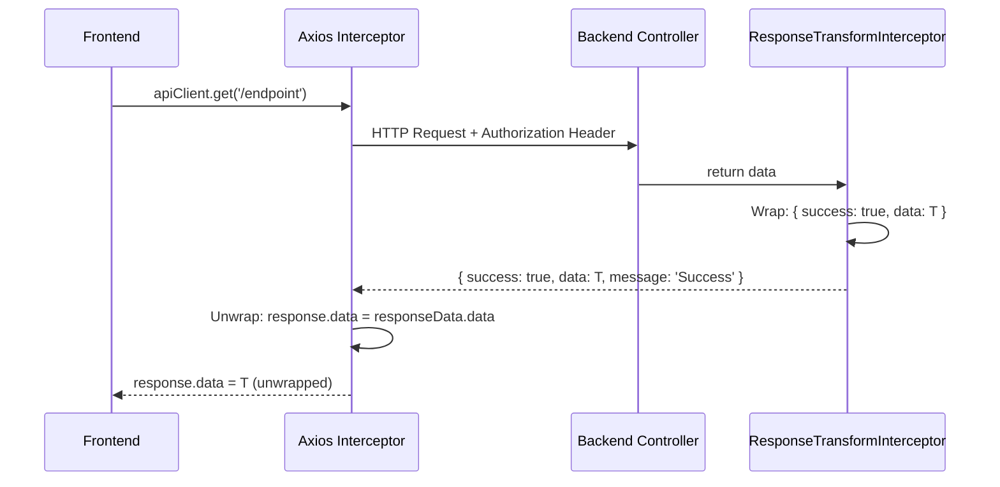

# API Layer Integration Audit Report

**Generated:** 2026-01-20  
**Auditor:** Senior System Integrator & API Specialist  
**Status:** Micro-Engineering Process - Step 1 (Audit Complete)

---

## Executive Summary

This forensic audit examines the communication layer between Frontend (React/Axios) and Backend (NestJS) to identify root causes of integration failures. The analysis reveals **well-aligned infrastructure** but **critical mismatches in error handling structures** that can cause silent failures and poor UX.

---

## 1. Infrastructure & Config Handshake

| Check | Frontend | Backend | Status |
|-------|----------|---------|--------|
| **Base URL** | `http://localhost:3000/api/v1` | Port 3000, Prefix `api/v1` | ✅ PASS |
| **CORS Origin** | `http://localhost:5173` | Allows `localhost:5173` | ✅ PASS |
| **CORS Credentials** | N/A | `credentials: true` | ✅ PASS |
| **Allowed Methods** | All | `GET, POST, PUT, DELETE, PATCH, OPTIONS` | ✅ PASS |
| **Allowed Headers** | `Content-Type`, `Authorization` | `Content-Type`, `Authorization` | ✅ PASS |

### Details

**Backend CORS Configuration** ([main.ts:46-58](file:///c:/Users/User/Desktop/rga-dashboard-main/backend/src/main.ts#L46-L58)):
```typescript
const corsOrigins = process.env.CORS_ORIGINS || 'http://localhost:5173,http://localhost:3000,http://localhost:3001';
app.enableCors({
  origin: [...originList, /^https:\/\/.*\.manus-asia\.computer$/, ...],
  credentials: true,
  methods: ['GET', 'POST', 'PUT', 'DELETE', 'PATCH', 'OPTIONS'],
  allowedHeaders: ['Content-Type', 'Authorization'],
});
```

**Backend Global Prefix** ([main.ts:61-72](file:///c:/Users/User/Desktop/rga-dashboard-main/backend/src/main.ts#L61-L72)):
```typescript
app.setGlobalPrefix('api/v1', {
  exclude: ['health', 'health/liveness', 'health/readiness', 'auth/google/ads/callback', ...]
});
```

**Frontend Base URL** ([api-client.ts:20-21](file:///c:/Users/User/Desktop/rga-dashboard-main/frontend/src/services/api-client.ts#L20-L21)):
```typescript
const API_BASE_URL = import.meta.env.VITE_API_URL || 'http://localhost:3000/api/v1';
```

> [!NOTE]
> Frontend has no `.env` file in repository. Base URL defaults to `http://localhost:3000/api/v1` which correctly matches backend configuration.

**Verdict:** ✅ Infrastructure handshake is correctly configured.

---

## 2. Response Structure Matrix (Happy Path)

### Data Flow Diagram



### Backend Response Wrapping

**ResponseTransformInterceptor** ([response-transform.interceptor.ts:28-41](file:///c:/Users/User/Desktop/rga-dashboard-main/backend/src/common/interceptors/response-transform.interceptor.ts#L28-L41)):
```typescript
return next.handle().pipe(
  map((data) => {
    // If data already has success property, return as-is
    if (data && typeof data === 'object' && 'success' in data) {
      return data;
    }
    return { success: true, data, message: 'Success' };
  }),
);
```

**Registration:** Globally registered in [app.module.ts:97-100](file:///c:/Users/User/Desktop/rga-dashboard-main/backend/src/app.module.ts#L97-L100)

### Frontend Auto-Unwrapping

**api-client.ts Response Interceptor** ([api-client.ts:72-99](file:///c:/Users/User/Desktop/rga-dashboard-main/frontend/src/services/api-client.ts#L72-L99)):
```typescript
apiClient.interceptors.response.use((response) => {
  const responseData = response.data;
  
  // Check if Standard Wrapped Response
  if (responseData && typeof responseData === 'object' && 
      'success' in responseData && 'data' in responseData) {
    if (!responseData.success) {
      return Promise.reject(new Error(responseData.message || 'API Error'));
    }
    // ✅ Unwrap: Return inner data directly
    response.data = responseData.data;
  }
  return response;
}, ...);
```

### Alignment Check

| Aspect | Backend Sends | Frontend Expects | Status |
|--------|--------------|------------------|--------|
| Success Response | `{ success: true, data: T, message: 'Success' }` | Checks for `success` + `data` keys | ✅ PASS |
| Auto-Unwrap | N/A | Extracts `responseData.data` | ✅ PASS |
| Service Layer Receives | N/A | `T` (pure data, no wrapper) | ✅ PASS |
| Double-Wrapping Risk | N/A | None (interceptor handles it) | ✅ PASS |

**Verdict:** ✅ Happy path response handling is correctly aligned. No double-wrapping issues.

---

## 3. Error Handling Mismatch (Unhappy Path)

> [!CAUTION]
> **CRITICAL MISMATCH DETECTED** - This is the primary root cause of "Integration Hell"

### 🔴 Critical Mismatch #1: Error Response Structure

**Backend HttpExceptionFilter** ([http-exception.filter.ts:13-22](file:///c:/Users/User/Desktop/rga-dashboard-main/backend/src/common/filters/http-exception.filter.ts#L13-L22)):
```typescript
response.status(status).json({
  statusCode: status,
  timestamp: new Date().toISOString(),
  path: request.url,
  message: typeof exceptionResponse === 'string'
    ? exceptionResponse
    : (exceptionResponse as any).message || exceptionResponse,
});
```

**Backend Error Structure (Reality):**
```json
{
  "statusCode": 401,
  "timestamp": "2026-01-20T10:33:12.000Z",
  "path": "/api/v1/auth/login",
  "message": "Invalid credentials"
}
```

**Frontend Error Expectation** ([auth-store.ts:88-98](file:///c:/Users/User/Desktop/rga-dashboard-main/frontend/src/stores/auth-store.ts#L88-L98)):
```typescript
const err = error as {
  response?: {
    data?: {
      message?: string;
      error?: string;      // ⚠️ Expected but not sent
      lockoutMinutes?: number;
      remainingAttempts?: number;
    }
  }
};
// ... switch (errorData?.error) { ... }
```

| Field | Backend Sends | Frontend Expects | Status |
|-------|--------------|------------------|--------|
| `statusCode` | ✅ Sent | ❌ Not used | ⚠️ OK |
| `message` | ✅ Sent | ✅ Read fallback | ✅ PASS |
| `error` | ❌ **NOT SENT** | ✅ Used for error codes | 🔴 **CRITICAL** |
| `lockoutMinutes` | ❌ NOT SENT | ✅ Expected for ACCOUNT_LOCKED | 🔴 **CRITICAL** |
| `remainingAttempts` | ❌ NOT SENT | ✅ Expected for INVALID_CREDENTIALS | 🔴 **CRITICAL** |
| `timestamp` | ✅ Sent | ❌ Not used | ℹ️ OK |
| `path` | ✅ Sent | ❌ Not used | ℹ️ OK |

### 🔴 Critical Mismatch #2: Missing `success: false` in Errors

The Frontend interceptor checks for `success: false` in the response body:
```typescript
if (!responseData.success) {
  const errorMessage = responseData.message || responseData.error || 'API Error';
  return Promise.reject(new Error(errorMessage));
}
```

However, the `HttpExceptionFilter` **never returns `success: false`**. This means:
1. Error responses bypass the success check (no `success` property exists)
2. Errors fall through to the axios error handler correctly
3. But there's inconsistency in error structure expectations

### 🔴 Critical Mismatch #3: Generic 500 Error Risk

**Risk Scenario:** If backend throws an unhandled exception or returns HTML (e.g., 502 Bad Gateway from proxy):

```typescript
// Frontend attempts:
const errorData = err.response?.data;
let message = errorData?.message || 'Login failed';  // ✅ Has fallback

// But this switch will never match:
switch (errorData?.error) {  // ❌ error is undefined, switch does nothing
  case 'ACCOUNT_LOCKED': ...
  case 'INVALID_CREDENTIALS': ...
}
```

**Impact:** User-friendly error messages for `ACCOUNT_LOCKED` and `INVALID_CREDENTIALS` will **NEVER** be shown.

---

## 4. Authentication Header Flow

### Token Injection Check

**Request Interceptor** ([api-client.ts:57-67](file:///c:/Users/User/Desktop/rga-dashboard-main/frontend/src/services/api-client.ts#L57-L67)):
```typescript
apiClient.interceptors.request.use((config: InternalAxiosRequestConfig) => {
  const token = getAccessToken();  // ✅ From token-manager
  if (token && config.headers) {
    config.headers.Authorization = `Bearer ${token}`;  // ✅ Correct format
  }
  return config;
}, ...);
```

| Check | Value | Status |
|-------|-------|--------|
| Header Key | `Authorization` | ✅ PASS |
| Header Value Format | `Bearer ${token}` (with space) | ✅ PASS |
| Token Source | `token-manager.ts` (localStorage) | ✅ PASS |
| Token Refresh Logic | Queues requests, auto-refreshes | ✅ PASS |

### Token Refresh Flow

**Refresh Token Handling** ([api-client.ts:123-148](file:///c:/Users/User/Desktop/rga-dashboard-main/frontend/src/services/api-client.ts#L123-L148)):
```typescript
const response = await axios.post(`${API_BASE_URL}/auth/refresh`, { refreshToken });
const { accessToken, refreshToken: newRefreshToken } = response.data.data;  // ✅ Expects wrapped response
```

**Backend Contract:** The refresh endpoint returns wrapped data, so `response.data.data` is correct.

**Verdict:** ✅ Authentication header flow is correctly implemented.

---

## Summary: Critical Mismatches

| ID | Category | Severity | Issue |
|----|----------|----------|-------|
| M1 | Error Structure | 🔴 CRITICAL | Backend doesn't send `error` field (AUTH_INTERFACE_CONTRACT violation) |
| M2 | Error Structure | 🔴 CRITICAL | Backend doesn't send `lockoutMinutes` or `remainingAttempts` |
| M3 | Error Structure | ⚠️ MEDIUM | Backend doesn't wrap errors in `{ success: false, data: null, error: ... }` |
| M4 | Error Type | ⚠️ MEDIUM | `HttpExceptionFilter` only catches `HttpException`, unhandled exceptions return raw Node errors |

---

## Refactor Plan (Step 2)

### Backend Changes Required

1. **Modify `http-exception.filter.ts`** to return standardized error structure:
   ```typescript
   {
     success: false,
     error: 'INVALID_CREDENTIALS',  // Error code
     message: 'Invalid email or password',
     statusCode: 401,
     data: {
       remainingAttempts?: number,
       lockoutMinutes?: number
     }
   }
   ```

2. **Create `AllExceptionsFilter`** to catch non-HTTP exceptions:
   - Return `{ success: false, error: 'INTERNAL_ERROR', message: ... }`
   - Prevent raw HTML or stack traces from reaching frontend

3. **Update `AuthService`** to throw exceptions with error metadata:
   ```typescript
   throw new UnauthorizedException({
     error: 'ACCOUNT_LOCKED',
     message: 'Account is locked',
     lockoutMinutes: 30
   });
   ```

### Frontend Changes (Optional)

4. **Consider updating error interceptor** to handle both formats:
   - Old format: `{ statusCode, message, path, timestamp }`
   - New format: `{ success: false, error, message, data }`

### Verification

5. **Test error scenarios:**
   - Login with invalid credentials → Should show remaining attempts
   - Login with locked account → Should show lockout duration
   - Server error (500) → Should show graceful error, not crash

---

## Files Analyzed

| Layer | File | Purpose |
|-------|------|---------|
| Frontend | [api-client.ts](file:///c:/Users/User/Desktop/rga-dashboard-main/frontend/src/services/api-client.ts) | Axios instance, interceptors |
| Frontend | [api.ts](file:///c:/Users/User/Desktop/rga-dashboard-main/frontend/src/types/api.ts) | Response type definitions |
| Frontend | [auth-store.ts](file:///c:/Users/User/Desktop/rga-dashboard-main/frontend/src/stores/auth-store.ts) | Auth state, error handling |
| Backend | [main.ts](file:///c:/Users/User/Desktop/rga-dashboard-main/backend/src/main.ts) | CORS, Global Prefix |
| Backend | [app.module.ts](file:///c:/Users/User/Desktop/rga-dashboard-main/backend/src/app.module.ts) | Interceptor registration |
| Backend | [response-transform.interceptor.ts](file:///c:/Users/User/Desktop/rga-dashboard-main/backend/src/common/interceptors/response-transform.interceptor.ts) | Response wrapping |
| Backend | [http-exception.filter.ts](file:///c:/Users/User/Desktop/rga-dashboard-main/backend/src/common/filters/http-exception.filter.ts) | Error formatting |
| Backend | [auth.controller.ts](file:///c:/Users/User/Desktop/rga-dashboard-main/backend/src/modules/auth/auth.controller.ts) | Auth endpoints |

---

## Conclusion

**Infrastructure: ✅ PASS** - CORS, URLs, and prefixes are correctly aligned.

**Happy Path: ✅ PASS** - Response wrapping and unwrapping work correctly.

**Unhappy Path: 🔴 FAIL** - Error structure mismatch prevents proper error UX.

**Auth Flow: ✅ PASS** - Token injection and refresh work correctly.

The primary integration issue is the **error response contract mismatch** between what the backend sends and what the frontend expects. This should be addressed in Step 2 (Fix) before proceeding with feature development.
