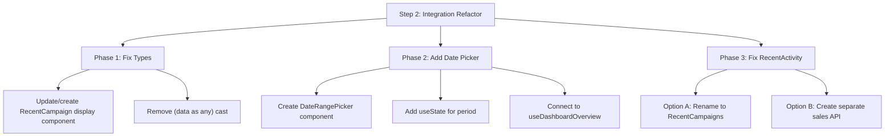

# Dashboard Data Integration Audit Report

**Date:** 2026-01-20  
**Status:** ✅ Integration Ready (Minor Gaps)  
**Author:** Automated Audit  

---

## Executive Summary

The dashboard integration between Backend API and Frontend UI is **well-architected**. The primary API endpoint (`GET /api/v1/dashboard/overview`) is fully implemented with proper DTOs, and the frontend has matching Zod schemas with runtime validation. Components are designed to accept data via props, enabling easy API integration.

### Key Findings
| Category | Status | Notes |
|----------|--------|-------|
| Backend API | ✅ Complete | `DashboardOverviewResponseDto` fully implemented |
| Frontend Types | ✅ Complete | Zod schemas match backend DTOs |
| Service Layer | ✅ Complete | `dashboard.service.ts` with validation |
| Component Props | ✅ Complete | All accept data via props |
| Date Range Picker | ⚠️ Missing | Only static button exists |
| RecentActivity Data | ⚠️ Mock Fallback | Uses `DEMO_DATA` when empty |
| Error Handling | ✅ Complete | Error state component exists |
| Loading State | ✅ Complete | Skeleton components in place |

---

## 1. Data Source Analysis

### 1.1 Where Data Flows From

```
┌─────────────────────────────────────────────────────────────────────┐
│                        DATA FLOW DIAGRAM                            │
├─────────────────────────────────────────────────────────────────────┤
│                                                                     │
│  Backend                    Frontend                                │
│  ─────────────────────      ──────────────────────────────────────  │
│                                                                     │
│  dashboard.controller.ts    api-client.ts (Auto-unwrap)             │
│         │                          │                                │
│         ▼                          ▼                                │
│  dashboard.service.ts       dashboard.service.ts                    │
│   (getOverview)              (getDashboardOverview)                 │
│         │                          │                                │
│         │                          ▼                                │
│         │                   use-dashboard.ts                        │
│         │                   (useDashboardOverview hook)             │
│         │                          │                                │
│         └──────── API ─────────────┤                                │
│                                    ▼                                │
│                             dashboard-page.tsx                      │
│                                    │                                │
│                    ┌───────────────┼───────────────┐                │
│                    ▼               ▼               ▼                │
│             DashboardMetrics  TrendChart    RecentActivity          │
│                                                                     │
└─────────────────────────────────────────────────────────────────────┘
```

### 1.2 Data Source Types

| Component | Data Source | Status | Details |
|-----------|-------------|--------|---------|
| `DashboardMetrics` | Props (`summary`, `growth`) | ✅ Dynamic | Accepts typed props from API |
| `TrendChart` | Props (`data: TrendDataPoint[]`) | ✅ Dynamic | Accepts typed props from API |
| `RecentActivity` | Props (`data: RecentActivityItem[]`) | ⚠️ Fallback | Falls back to `DEMO_DATA` if empty |
| `SummaryCard` | Props | ✅ Dynamic | Fully parameterized |

### 1.3 Identified Mock Data Locations

| File | Location | Type | Action Required |
|------|----------|------|-----------------|
| [recent-activity.tsx](file:///c:/Users/User/Desktop/rga-dashboard-main/frontend/src/features/dashboard/components/widgets/recent-activity.tsx#L40-L91) | Lines 40-91 | `DEMO_DATA` constant | ⚠️ Falls back when API returns empty |
| [dashboard-page.tsx](file:///c:/Users/User/Desktop/rga-dashboard-main/frontend/src/features/dashboard/pages/dashboard-page.tsx#L102) | Line 102 | Type assertion `(data as any)` | ⚠️ Unsafe type casting for `recentActivity` |

> [!IMPORTANT]
> The `RecentActivity` widget expects `RecentActivityItem[]` but the API returns `RecentCampaign[]`. This is a **type mismatch** - the widget shows "sales" but receives "campaigns".

---

## 2. API Readiness & Type Safety

### 2.1 Backend API Response Structure

**Endpoint:** `GET /api/v1/dashboard/overview`

```typescript
// Backend Response (from dashboard.service.ts)
{
  success: true,
  data: {
    summary: {
      totalImpressions: number,
      totalClicks: number,
      totalCost: number,
      totalConversions: number,
      averageCtr: number,
      averageRoas: number,
    },
    growth: {
      impressionsGrowth: number | null,
      clicksGrowth: number | null,
      costGrowth: number | null,
      conversionsGrowth: number | null,
    },
    trends: Array<{
      date: string,      // "YYYY-MM-DD"
      impressions: number,
      clicks: number,
      cost: number,
      conversions: number,
    }>,
    recentCampaigns: Array<{
      id: string,        // UUID
      name: string,
      status: CampaignStatus,
      platform: AdPlatform,
      spending: number,
      budgetUtilization?: number,
    }>,
  },
  meta: {
    period: PeriodEnum,
    dateRange: { from: string, to: string },
    tenantId: string,
    generatedAt: string,
  },
}
```

### 2.2 Frontend Type Definition (Already Exists ✅)

**Location:** [schemas.ts](file:///c:/Users/User/Desktop/rga-dashboard-main/frontend/src/features/dashboard/schemas.ts)

```typescript
// Already fully defined with Zod validation
export const DashboardOverviewDataSchema = z.object({
    summary: SummaryMetricsSchema,
    growth: GrowthMetricsSchema,
    trends: z.array(TrendDataPointSchema),
    recentCampaigns: z.array(RecentCampaignSchema),
}).strict();

export type DashboardOverviewData = z.infer<typeof DashboardOverviewDataSchema>;
```

### 2.3 Data Mapping Table

| UI Component | UI Field | API Field | Type | Match |
|--------------|----------|-----------|------|-------|
| `DashboardMetrics` | Total Spend | `data.summary.totalCost` | `number` | ✅ |
| `DashboardMetrics` | Impressions | `data.summary.totalImpressions` | `number` | ✅ |
| `DashboardMetrics` | Clicks | `data.summary.totalClicks` | `number` | ✅ |
| `DashboardMetrics` | Conversions | `data.summary.totalConversions` | `number` | ✅ |
| `DashboardMetrics` | Cost Trend | `data.growth.costGrowth` | `number \| null` | ✅ |
| `TrendChart` | Chart Data | `data.trends[]` | `TrendDataPoint[]` | ✅ |
| `RecentActivity` | User Sales | `data.recentCampaigns[]` | ❌ TYPE MISMATCH | See note |

> [!WARNING]
> **Type Mismatch Found:**  
> `RecentActivity` expects `RecentActivityItem` with `user: { name, email, avatar }` and `amount`.  
> API returns `RecentCampaign` with `name`, `status`, `platform`, `spending`.  
> These are semantically different - the widget needs redesign or a separate API.

---

## 3. Date Range Logic

### 3.1 Current Implementation

| Check | Status | Details |
|-------|--------|---------|
| DateRangePicker UI Component | ❌ Missing | Only a static `<Button>` with "Last 7 days" text exists |
| Date Range State (React) | ❌ Missing | `period` is hardcoded as `'7d'` in hook call |
| API Query Params | ✅ Supported | Backend accepts `?period=7d|30d|this_month|last_month` |
| Custom Date Range | ❌ Not Supported | API uses `PeriodEnum`, not `startDate/endDate` params |

### 3.2 Current Code

```typescript
// dashboard-page.tsx (Line 48-50)
const { data, isLoading, error, refetch } = useDashboardOverview({
    period: '7d',  // 🔴 HARDCODED - No UI to change
});
```

```typescript
// Static button (not a picker) - Line 64-68
<Button variant="outline" size="sm" className="gap-2">
    <Calendar className="h-4 w-4" />
    <span className="hidden sm:inline">Last 7 days</span>  // 🔴 Static text
</Button>
```

### 3.3 Required Changes for Date Filtering

1. **Create `useDateRangeState` hook** or use React state in `dashboard-page.tsx`
2. **Create `DateRangePicker` component** with dropdown for period selection
3. **Connect picker to hook:** Pass selected period to `useDashboardOverview({ period })`

---

## 4. Loading & Error Handling

### 4.1 Loading States ✅

| Component | Skeleton UI | Status |
|-----------|-------------|--------|
| `DashboardMetrics` | Via `SummaryCard` | ✅ `SummaryCardSkeleton` |
| `TrendChart` | Via `dashboard-page.tsx` | ✅ `<Skeleton className="h-[400px]">` |
| `RecentActivity` | Via `dashboard-page.tsx` | ✅ `<Skeleton className="h-[400px]">` |

### 4.2 Error State ✅

```typescript
// dashboard-page.tsx has ErrorState component
function ErrorState({ error, onRetry }: ErrorStateProps) {
    return (
        <Alert variant="destructive">
            <AlertTriangle />
            <AlertTitle>Failed to load dashboard data</AlertTitle>
            <AlertDescription>
                {error.message}
                <Button onClick={onRetry}>Retry</Button>
            </AlertDescription>
        </Alert>
    );
}
```

### 4.3 API Client Auto-Unwrap ✅

The `api-client.ts` automatically unwraps `{ success, data }` responses:

```typescript
// api-client.ts (Lines 79-96)
if (responseData && 'success' in responseData && 'data' in responseData) {
    if (!responseData.success) {
        return Promise.reject(new Error(errorMessage));
    }
    response.data = responseData.data;  // ✅ Auto-unwrap
}
```

---

## 5. Missing Components & Refactor Strategy

### 5.1 Missing Logic Checklist

| Item | Priority | Description |
|------|----------|-------------|
| DateRange State | 🔴 High | No React state for period selection |
| DateRangePicker Component | 🔴 High | No UI component for changing period |
| RecentActivity API | 🟡 Medium | Widget expects "sales" but receives "campaigns" |
| RecentActivityItem Type | 🟡 Medium | Type doesn't match API response |

### 5.2 Refactor Strategy (Step 2 Plan)



### 5.3 Priority Order

1. **Fix Type Safety First**
   - Remove `(data as any)` casting in `dashboard-page.tsx:102`
   - Either rename `RecentActivity` → `RecentCampaigns` OR create adapter

2. **Add Date Range Functionality**
   - Create `PeriodSelector` dropdown component
   - Wire to `useDashboardOverview` hook

3. **Clean Up Fallback Data**
   - Remove `DEMO_DATA` from `RecentActivity` (or move to Storybook)

---

## 6. Type Definition Draft

### 6.1 Properly Typed Dashboard Response (Already Exists)

The types are already well-defined in [schemas.ts](file:///c:/Users/User/Desktop/rga-dashboard-main/frontend/src/features/dashboard/schemas.ts). No changes needed.

### 6.2 Missing Type: RecentCampaigns Display Adapter

```typescript
// Proposed: src/features/dashboard/adapters/campaign-to-activity.ts

import type { RecentCampaign } from '../schemas';
import type { RecentActivityItem } from '../components/widgets/recent-activity';

/**
 * Adapter to transform RecentCampaign to RecentActivityItem
 * USE ONLY if keeping RecentActivity widget for campaigns
 */
export function adaptCampaignToActivity(
    campaign: RecentCampaign
): RecentActivityItem {
    return {
        id: campaign.id,
        user: {
            name: campaign.name,
            email: `${campaign.platform.toLowerCase()}@campaign`,
            avatar: undefined,
        },
        amount: campaign.spending,
        status: campaign.status,
    };
}
```

> [!NOTE]
> **Recommendation:** Rather than adapting, rename the component to `RecentCampaigns` and update its props to match the API response directly.

---

## 7. Conclusion

### ✅ What's Working Well
- Backend API is production-ready with proper DTOs
- Frontend has strict Zod validation
- Component architecture follows props-based design
- Loading and error states are implemented
- API client auto-unwraps responses

### ⚠️ What Needs Work
1. **DateRangePicker** - Add interactive period selection
2. **RecentActivity mismatch** - Widget design doesn't match API data
3. **Type casting** - `(data as any)` should be fixed

### 📋 Next Steps (Step 2)
1. Create `PeriodSelector` component with dropdown
2. Add `period` state to `dashboard-page.tsx`
3. Rename `RecentActivity` → `RecentCampaigns` with proper types
4. Remove unsafe type casts

---

**Audit Complete** ✅
