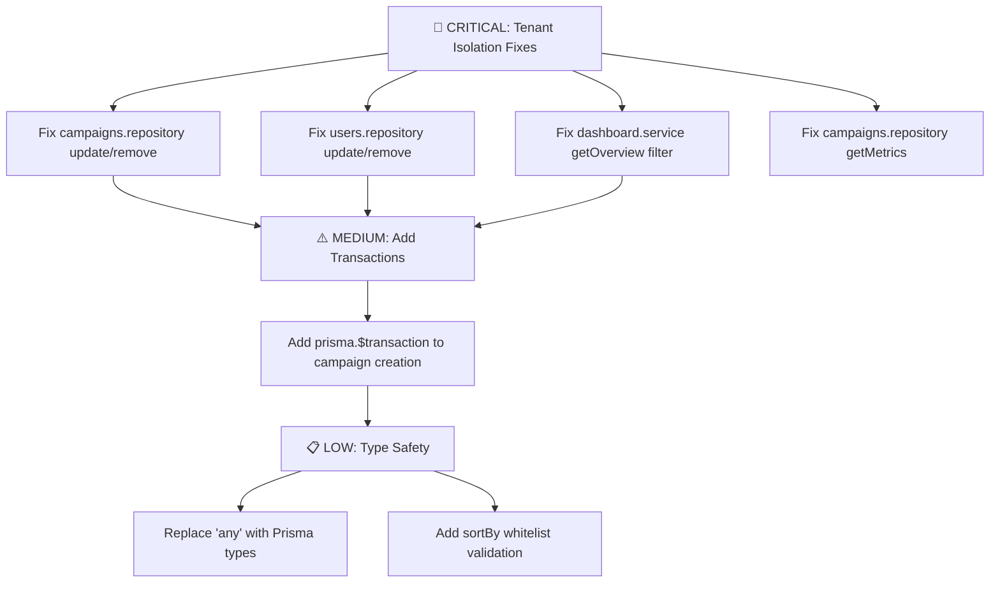

# 🕵️‍♂️ Backend Audit Snapshot (Single Source of Truth)

**Date:** 2026-01-21  
**Audit Scope:** Full Backend Codebase  
**Framework:** NestJS (Modular Monolith) + Prisma ORM + PostgreSQL  
**Auditor:** AI Deep Code Audit

---

## 1. 🚨 Critical Vulnerabilities (Must Fix Before Proceeding)

| File | Line(s) | Issue Description | Security Risk | Recommended Architecture Fix |
|------|---------|-------------------|---------------|------------------------------|
| [campaigns.repository.ts](file:///c:/Users/User/Desktop/rga-dashboard-main/backend/src/modules/campaigns/campaigns.repository.ts#L112-L118) | 112-118 | `update()` method uses `where: { id }` without `tenantId` validation | **Cross-Tenant Data Modification** - Attacker can modify any campaign by ID | Add compound where: `{ id, tenantId }` or use `updateFirst` with tenant filter |
| [campaigns.repository.ts](file:///c:/Users/User/Desktop/rga-dashboard-main/backend/src/modules/campaigns/campaigns.repository.ts#L120-L124) | 120-124 | `remove()` method uses `where: { id }` without `tenantId` validation | **Cross-Tenant Data Deletion** - Attacker can delete any campaign by ID | Add compound where: `{ id, tenantId }` or use Prisma middleware |
| [users.repository.ts](file:///c:/Users/User/Desktop/rga-dashboard-main/backend/src/modules/users/users.repository.ts#L82-L86) | 82-86 | `update()` method uses `where: { id }` without `tenantId` validation | **Cross-Tenant User Modification** - Privilege escalation possible | Add compound where or use tenant-aware update |
| [users.repository.ts](file:///c:/Users/User/Desktop/rga-dashboard-main/backend/src/modules/users/users.repository.ts#L89-L93) | 89-93 | `remove()` method uses `where: { id }` without `tenantId` validation | **Cross-Tenant User Deactivation** - Attacker can deactivate any user | Add compound where: `{ id, tenantId }` |
| [dashboard.service.ts](file:///c:/Users/User/Desktop/rga-dashboard-main/backend/src/modules/dashboard/dashboard.service.ts#L557-L569) | 557-569 | `getOverview()` aggregates metrics using `tenantId` directly on Metric table | **Incorrect Filter Path** - Metric table requires `campaign.tenantId` relation filter | Use `{ campaign: { tenantId } }` instead of `{ tenantId }` |
| [campaigns.repository.ts](file:///c:/Users/User/Desktop/rga-dashboard-main/backend/src/modules/campaigns/campaigns.repository.ts#L126-L139) | 126-139 | `getMetrics()` queries only by `campaignId` without tenant validation | **Potential Data Leak** - If campaignId is guessed, metrics can be retrieved | Add `where: { campaignId, campaign: { tenantId } }` or verify ownership upstream |

---

## 2. ⚠️ Architectural Debt (Technical Debt)

### 🏗️ Repository Layer Issues

- [ ] **No Transaction Wrapping:** `campaigns.service.ts` creates campaigns and audit logs without atomic transaction
  - **Location:** [campaigns.service.ts:34-43](file:///c:/Users/User/Desktop/rga-dashboard-main/backend/src/modules/campaigns/campaigns.repository.ts#L34-L43)
  - **Suggestion:** Wrap `repository.create()` + `auditLogsService.createLog()` in `prisma.$transaction`

- [ ] **Type Safety:** `data: any` parameter used in repository methods
  - **Location:** [campaigns.repository.ts:10](file:///c:/Users/User/Desktop/rga-dashboard-main/backend/src/modules/campaigns/campaigns.repository.ts#L10), [campaigns.repository.ts:112](file:///c:/Users/User/Desktop/rga-dashboard-main/backend/src/modules/campaigns/campaigns.repository.ts#L112)
  - **Suggestion:** Use `Prisma.CampaignUpdateInput` for strict typing

### ⚡ Performance Concerns

- [ ] **N+1 Query Pattern:** `seedMockData()` loops through campaigns and GA4 accounts with individual queries
  - **Location:** [dashboard.service.ts:364-395](file:///c:/Users/User/Desktop/rga-dashboard-main/backend/src/modules/dashboard/dashboard.service.ts#L364-L395)
  - **Suggestion:** Use `Promise.all` or bulk insert patterns

### 📋 DTO Validation Status

| DTO | Status | Notes |
|-----|--------|-------|
| `CreateCampaignDto` | ✅ **Good** | Uses `@IsString`, `@IsEnum`, `@IsNumber`, `@IsPositive`, `@IsDateString` |
| `UpdateCampaignDto` | ✅ **Good** | All fields properly optional with validators |
| `QueryCampaignsDto` | ✅ **Good** | Proper `@Type()` transforms and `@Min()` constraints |
| `QueryUsersDto` | ⚠️ **Review** | Missing `@Max()` limit constraint (DoS via large limit) |

### 🔀 Sorting Injection Risk

- [ ] **Unsafe Dynamic OrderBy:** `sortBy` field from query directly used in `orderBy[sortBy]`
  - **Location:** [campaigns.repository.ts:69-72](file:///c:/Users/User/Desktop/rga-dashboard-main/backend/src/modules/campaigns/campaigns.repository.ts#L69-L72)
  - **Suggestion:** Whitelist allowed sort fields: `['name', 'createdAt', 'status', 'platform']`

---

## 3. ✅ Strengths Found

| Area | Finding |
|------|---------|
| **Tenant Isolation (Read)** | `findOne`, `findAll` methods correctly include `tenantId` in `where` clause |
| **DTO Validation** | Comprehensive use of `class-validator` decorators |
| **Error Handling** | Proper `NotFoundException`, `ForbiddenException` usage throughout |
| **CSV Injection Prevention** | `export.service.ts` sanitizes values with `DANGEROUS_CSV_CHARS` regex |
| **RBAC Check** | `getOverview()` validates `SUPER_ADMIN` role for tenant override |
| **Password Security** | `bcrypt` with salt rounds = 10 for password hashing |
| **Streaming Export** | Memory-efficient cursor pagination with BATCH_SIZE = 500 |

---

## 4. 📈 Verification Plan (Definition of Done)

### Unit Tests (New)

- [ ] **`should_throw_error_if_tenant_id_mismatch_on_update`**
  ```typescript
  // Test: Attempt to update campaign belonging to different tenant
  // Expected: NotFoundException or ForbiddenException
  ```

- [ ] **`should_throw_error_if_tenant_id_mismatch_on_delete`**
  ```typescript
  // Test: Attempt to delete user from different tenant
  // Expected: NotFoundException or ForbiddenException
  ```

### Integration Tests (Existing - E2E)

| Test File | Status | Run Command |
|-----------|--------|-------------|
| [campaigns.e2e.spec.ts](file:///c:/Users/User/Desktop/rga-dashboard-main/backend/test/campaigns.e2e.spec.ts) | ⚠️ **Review** | `npm run test:e2e -- campaigns.e2e.spec.ts` |
| [users.e2e.spec.ts](file:///c:/Users/User/Desktop/rga-dashboard-main/backend/test/users.e2e.spec.ts) | ⚠️ **Review** | `npm run test:e2e -- users.e2e.spec.ts` |
| [dashboard.e2e.spec.ts](file:///c:/Users/User/Desktop/rga-dashboard-main/backend/test/dashboard.e2e.spec.ts) | ⚠️ **Review** | `npm run test:e2e -- dashboard.e2e.spec.ts` |

### Manual Security Tests

- [ ] **Cross-Tenant Update Test:**
  1. Create Campaign A under Tenant 1
  2. Login as User from Tenant 2
  3. Send `PATCH /api/v1/campaigns/{campaignA.id}` with modified data
  4. **Expected:** Should return 404 or 403, NOT 200

- [ ] **Cross-Tenant Delete Test:**
  1. Create User A under Tenant 1
  2. Login as Admin from Tenant 2
  3. Send `DELETE /api/v1/users/{userA.id}`
  4. **Expected:** Should return 404 or 403, NOT 200

---

## 5. 🎯 Recommended Fix Priority



---

## 6. 📁 Files Requiring Immediate Attention

1. **[campaigns.repository.ts](file:///c:/Users/User/Desktop/rga-dashboard-main/backend/src/modules/campaigns/campaigns.repository.ts)** - Lines 112-124
2. **[users.repository.ts](file:///c:/Users/User/Desktop/rga-dashboard-main/backend/src/modules/users/users.repository.ts)** - Lines 82-93
3. **[dashboard.service.ts](file:///c:/Users/User/Desktop/rga-dashboard-main/backend/src/modules/dashboard/dashboard.service.ts)** - Lines 557-569

---

*End of Report. Use this document as the reference for the next Refactoring Task.*
