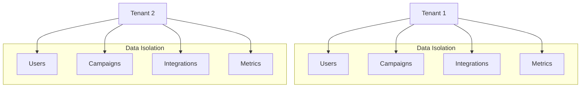
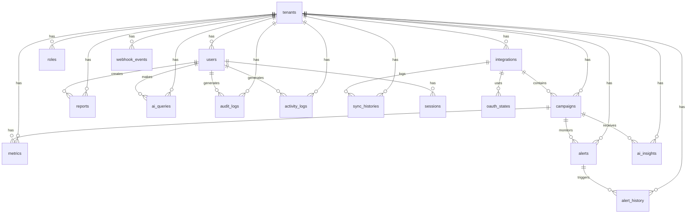
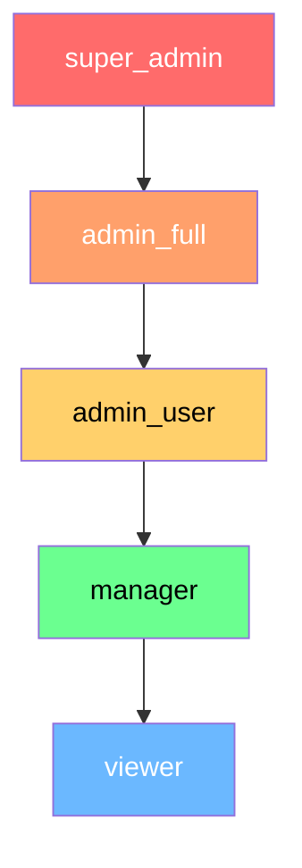

# 📊 RGA Dashboard Database Documentation

> **เอกสารนี้จัดทำขึ้นเพื่อ:** อธิบายโครงสร้างฐานข้อมูล RGA Dashboard อย่างละเอียด เพื่อให้ทีมพัฒนาเข้าใจภาพรวมทั้งหมด

---

## 📁 โครงสร้างโฟลเดอร์ Database

```
database/
├── README.md                    # คู่มือการใช้งาน
├── setup_rga_dashboard.sql      # (ว่าง - ใช้ใน sql/)
├── sql/
│   ├── schema.sql               # Schema แบบ compact (481 บรรทัด)
│   ├── setup_rga_dashboard.sql  # Full setup script (636 บรรทัด)
│   └── create_admin_user.sql    # สร้าง Admin users
└── verify/
    ├── 01_tables_count.sql      # ตรวจสอบจำนวน tables
    ├── 02_list_tables.sql       # แสดงรายชื่อ tables
    ├── 03_extensions.sql        # ตรวจสอบ extensions
    ├── 04_indexes_count.sql     # นับจำนวน indexes
    ├── 05_foreign_keys_count.sql # นับจำนวน foreign keys
    ├── 06_tenants_data.sql      # ตรวจสอบข้อมูล tenants
    ├── 07_users_data.sql        # ตรวจสอบข้อมูล users
    ├── 08_triggers.sql          # แสดง triggers
    ├── 09_functions.sql         # แสดง functions
    ├── 10_table_sizes.sql       # ขนาดของ tables
    ├── 11_constraints.sql       # แสดง constraints
    ├── 12_key_indexes.sql       # แสดง key indexes
    ├── 99_health_check.sql      # Quick health check
    └── verify_database.sql      # Verification รวม (all-in-one)
```

---

## 🗄️ ภาพรวมฐานข้อมูล (Database Overview)

| รายการ | ค่า |
|--------|-----|
| **Database Name** | `rga_dashboard` |
| **PostgreSQL Version** | 15+ (Recommended) |
| **Total Tables** | **17 Tables** |
| **Architecture** | Multi-tenant |
| **Primary Key Type** | UUID (uuid-ossp extension) |

---

## 🏗️ สถาปัตยกรรม Multi-tenant



> [!IMPORTANT]
> **Multi-tenant Architecture:** ทุก table (ยกเว้น `sessions`) มี `tenant_id` เป็น foreign key ที่อ้างอิงไปยัง `tenants` table โดยใช้ `ON DELETE CASCADE` เพื่อให้ข้อมูลถูกลบอัตโนมัติเมื่อลบ tenant

---

## 📋 รายละเอียด Tables ทั้งหมด (17 Tables)

### 🔷 กลุ่มที่ 1: Core Tables (หลัก)

---

#### 1. `tenants` - องค์กร/ลูกค้า

> **Purpose:** เก็บข้อมูลองค์กรหรือลูกค้าแต่ละราย (Multi-tenant)

| Column | Type | Description |
|--------|------|-------------|
| `id` | UUID | Primary Key (auto-generated) |
| `name` | VARCHAR(255) | ชื่อองค์กร (required) |
| `slug` | VARCHAR(100) | URL-friendly identifier (unique) |
| `domain` | VARCHAR(255) | โดเมนขององค์กร |
| `logo_url` | TEXT | URL ของโลโก้ |
| `primary_color` | VARCHAR(7) | สีหลัก (default: #3B82F6) |
| `secondary_color` | VARCHAR(7) | สีรอง (default: #10B981) |
| `timezone` | VARCHAR(50) | Timezone (default: Asia/Bangkok) |
| `currency` | VARCHAR(3) | สกุลเงิน (default: THB) |
| `language` | VARCHAR(5) | ภาษา (default: th) |
| `subscription_plan` | VARCHAR(50) | แพลน: basic/enterprise |
| `subscription_status` | VARCHAR(20) | สถานะ: active/inactive |
| `subscription_ends_at` | TIMESTAMP | วันหมดอายุ subscription |
| `created_at` | TIMESTAMP | วันที่สร้าง |
| `updated_at` | TIMESTAMP | วันที่อัพเดตล่าสุด |
| `deleted_at` | TIMESTAMP | Soft delete timestamp |

---

#### 2. `users` - ผู้ใช้งาน

> **Purpose:** เก็บข้อมูลผู้ใช้แต่ละคน พร้อมระบบ Role-based Access Control

| Column | Type | Description |
|--------|------|-------------|
| `id` | UUID | Primary Key |
| `tenant_id` | UUID | FK → tenants(id) ON DELETE CASCADE |
| `email` | VARCHAR(255) | อีเมล (unique per tenant) |
| `password_hash` | VARCHAR(255) | รหัสผ่าน (bcrypt hashed) |
| `first_name` | VARCHAR(100) | ชื่อ |
| `last_name` | VARCHAR(100) | นามสกุล |
| `phone` | VARCHAR(20) | เบอร์โทร |
| `avatar_url` | TEXT | URL รูปโปรไฟล์ |
| `role` | VARCHAR(50) | บทบาท: super_admin, admin, user |
| `admin_type` | VARCHAR(50) | ประเภท admin: admin_a, admin_b |
| `is_active` | BOOLEAN | สถานะใช้งาน (default: true) |
| `email_verified` | BOOLEAN | ยืนยันอีเมลแล้วหรือไม่ |
| `two_factor_enabled` | BOOLEAN | เปิด 2FA หรือไม่ |
| `last_login_at` | TIMESTAMP | เข้าสู่ระบบล่าสุด |
| `last_login_ip` | VARCHAR(45) | IP ที่เข้าสู่ระบบล่าสุด |
| `created_at` | TIMESTAMP | วันที่สร้าง |
| `updated_at` | TIMESTAMP | วันที่อัพเดต |
| `deleted_at` | TIMESTAMP | Soft delete |

**Unique Constraint:** `(tenant_id, email)` - อีเมลต้องไม่ซ้ำภายใน tenant เดียวกัน

**Indexes:**
- `idx_users_tenant` — tenant_id
- `idx_users_email` — email
- `idx_users_role` — role
- `idx_users_is_active` — is_active

---

#### 3. `roles` - บทบาทและสิทธิ์

> **Purpose:** กำหนดบทบาทและ permissions แบบ custom ได้

| Column | Type | Description |
|--------|------|-------------|
| `id` | UUID | Primary Key |
| `tenant_id` | UUID | FK → tenants(id) |
| `name` | VARCHAR(100) | ชื่อ role (unique per tenant) |
| `description` | TEXT | คำอธิบาย |
| `permissions` | JSONB | รายการ permissions (array) |

---

### 🔷 กลุ่มที่ 2: Integration & Campaign Tables

---

#### 4. `integrations` - การเชื่อมต่อ Platform

> **Purpose:** เก็บข้อมูลการเชื่อมต่อกับ platforms ภายนอก

| Column | Type | Description |
|--------|------|-------------|
| `id` | UUID | Primary Key |
| `tenant_id` | UUID | FK → tenants(id) |
| `type` | VARCHAR(50) | google_ads, facebook_ads, ga4, tiktok, shopee, lazada |
| `name` | VARCHAR(255) | ชื่อ integration |
| `provider` | VARCHAR(50) | ผู้ให้บริการ |
| `credentials` | JSONB | Encrypted credentials |
| `config` | JSONB | Configuration settings |
| `status` | VARCHAR(20) | active, inactive, error |
| `is_active` | BOOLEAN | เปิดใช้งานหรือไม่ |
| `last_sync_at` | TIMESTAMP | sync ล่าสุด |
| `sync_frequency_minutes` | INTEGER | ความถี่ sync (default: 15 นาที) |

**Supported Platforms:**
- Google Ads
- Facebook Ads
- Google Analytics 4 (GA4)
- TikTok Ads
- Shopee
- Lazada

---

#### 5. `campaigns` - แคมเปญการตลาด

> **Purpose:** เก็บข้อมูลแคมเปญโฆษณาจาก platforms ต่างๆ

| Column | Type | Description |
|--------|------|-------------|
| `id` | UUID | Primary Key |
| `tenant_id` | UUID | FK → tenants(id) |
| `integration_id` | UUID | FK → integrations(id) |
| `external_id` | VARCHAR(255) | ID จาก platform ภายนอก |
| `name` | VARCHAR(255) | ชื่อแคมเปญ |
| `platform` | VARCHAR(50) | google, facebook, tiktok, etc. |
| `campaign_type` | VARCHAR(50) | search, display, shopping, video |
| `objective` | VARCHAR(50) | awareness, consideration, conversion |
| `status` | VARCHAR(20) | active, paused, ended |
| `budget` | DECIMAL(15,2) | งบประมาณ |
| `budget_type` | VARCHAR(20) | daily, lifetime |
| `currency` | VARCHAR(3) | สกุลเงิน (default: THB) |
| `start_date` | DATE | วันเริ่มต้น |
| `end_date` | DATE | วันสิ้นสุด |

**Unique Constraint:** `(tenant_id, platform, external_id)`

---

### 🔷 กลุ่มที่ 3: Metrics & Analytics Tables

---

#### 6. `metrics` - ข้อมูล Time-series Performance

> **Purpose:** เก็บ metrics ด้านประสิทธิภาพโฆษณาแบบ time-series

| Column | Type | Description |
|--------|------|-------------|
| `id` | UUID | Primary Key |
| `tenant_id` | UUID | FK → tenants(id) |
| `campaign_id` | UUID | FK → campaigns(id) |
| `date` | DATE | วันที่ (required) |
| `hour` | INTEGER | ชั่วโมง (0-23) |
| `platform` | VARCHAR(50) | Platform ที่มา |
| `source` | VARCHAR(100) | campaign, adset, ad, keyword |
| **Advertising Metrics** |||
| `impressions` | INTEGER | จำนวนการแสดงผล |
| `clicks` | INTEGER | จำนวนคลิก |
| `conversions` | INTEGER | จำนวน conversions |
| `spend` | DECIMAL(15,2) | ค่าใช้จ่าย |
| `cost_per_click` | DECIMAL(10,4) | CPC |
| `cost_per_mille` | DECIMAL(10,4) | CPM |
| `cost_per_action` | DECIMAL(10,4) | CPA |
| **Performance** |||
| `ctr` | DECIMAL(8,4) | Click-through Rate |
| `conversion_rate` | DECIMAL(8,4) | อัตรา Conversion |
| `roas` | DECIMAL(10,4) | Return on Ad Spend |
| **Revenue** |||
| `revenue` | DECIMAL(15,2) | รายได้ |
| `orders` | INTEGER | จำนวนออเดอร์ |
| `average_order_value` | DECIMAL(10,2) | AOV |
| `cart_abandonment_rate` | DECIMAL(8,4) | อัตราทิ้งตะกร้า |
| **SEO Metrics** |||
| `organic_traffic` | INTEGER | Traffic จาก organic |
| `bounce_rate` | DECIMAL(8,4) | อัตรา bounce |
| `avg_session_duration` | INTEGER | ระยะเวลา session (วินาที) |
| `metadata` | JSONB | ข้อมูลเพิ่มเติม |

**Unique Constraint:** `(tenant_id, campaign_id, date, hour, platform, source)`

**Indexes (Optimized for Time-series Queries):**
- `idx_metrics_tenant_date` — (tenant_id, date DESC)
- `idx_metrics_campaign_date` — (campaign_id, date DESC)
- `idx_metrics_platform` — platform
- `idx_metrics_date` — date DESC

---

### 🔷 กลุ่มที่ 4: Alert & Notification Tables

---

#### 7. `alerts` - การตั้งค่าการแจ้งเตือน

> **Purpose:** กำหนดเงื่อนไขการแจ้งเตือนเมื่อ metrics ถึง threshold

| Column | Type | Description |
|--------|------|-------------|
| `id` | UUID | Primary Key |
| `tenant_id` | UUID | FK → tenants(id) |
| `campaign_id` | UUID | FK → campaigns(id) (optional) |
| `name` | VARCHAR(255) | ชื่อ alert |
| `description` | TEXT | คำอธิบาย |
| `alert_type` | VARCHAR(50) | threshold, anomaly, budget |
| `metric` | VARCHAR(50) | ctr, cpc, conversions, spend, etc. |
| `operator` | VARCHAR(10) | gt, lt, eq, gte, lte |
| `threshold` | DECIMAL(15,4) | ค่า threshold |
| `notification_channels` | JSONB | ["email", "sms", "webhook"] |
| `recipients` | JSONB | รายชื่อผู้รับ |
| `is_active` | BOOLEAN | เปิดใช้งาน |
| `last_triggered_at` | TIMESTAMP | trigger ล่าสุด |
| `trigger_count` | INTEGER | จำนวนครั้งที่ trigger |

---

#### 8. `alert_history` - ประวัติการแจ้งเตือน

> **Purpose:** บันทึกประวัติเมื่อ alert ถูก trigger

| Column | Type | Description |
|--------|------|-------------|
| `id` | UUID | Primary Key |
| `alert_id` | UUID | FK → alerts(id) ON DELETE CASCADE |
| `tenant_id` | UUID | FK → tenants(id) |
| `triggered_at` | TIMESTAMP | เวลาที่ trigger |
| `metric_value` | DECIMAL(15,4) | ค่า metric ขณะ trigger |
| `threshold_value` | DECIMAL(15,4) | ค่า threshold ที่ตั้งไว้ |
| `message` | TEXT | ข้อความแจ้งเตือน |
| `metadata` | JSONB | ข้อมูลเพิ่มเติม |
| `notification_sent` | BOOLEAN | ส่งการแจ้งเตือนแล้วหรือไม่ |
| `notification_sent_at` | TIMESTAMP | เวลาที่ส่ง |

---

### 🔷 กลุ่มที่ 5: Report & AI Tables

---

#### 9. `reports` - รายงาน

> **Purpose:** เก็บ configuration และไฟล์รายงาน

| Column | Type | Description |
|--------|------|-------------|
| `id` | UUID | Primary Key |
| `tenant_id` | UUID | FK → tenants(id) |
| `created_by` | UUID | FK → users(id) |
| `name` | VARCHAR(255) | ชื่อรายงาน |
| `description` | TEXT | คำอธิบาย |
| `report_type` | VARCHAR(50) | campaign, platform, custom |
| `date_range_type` | VARCHAR(20) | today, yesterday, last_7_days, last_30_days, custom |
| `start_date` | DATE | วันเริ่มต้น (สำหรับ custom) |
| `end_date` | DATE | วันสิ้นสุด |
| `filters` | JSONB | ตัวกรองข้อมูล |
| `metrics` | JSONB | Metrics ที่รวมในรายงาน |
| **Schedule** |||
| `is_scheduled` | BOOLEAN | ตั้งเวลาส่งหรือไม่ |
| `schedule_frequency` | VARCHAR(20) | daily, weekly, monthly |
| `schedule_time` | TIME | เวลาส่ง |
| `schedule_day_of_week` | INTEGER | วันในสัปดาห์ (0-6) |
| `schedule_day_of_month` | INTEGER | วันที่ในเดือน (1-31) |
| **Export** |||
| `export_format` | VARCHAR(10) | pdf, csv, excel |
| `file_url` | TEXT | URL ไฟล์รายงาน |
| `file_size` | INTEGER | ขนาดไฟล์ (bytes) |

---

#### 10. `ai_insights` - AI-Generated Insights

> **Purpose:** เก็บ insights และคำแนะนำที่สร้างโดย AI

| Column | Type | Description |
|--------|------|-------------|
| `id` | UUID | Primary Key |
| `tenant_id` | UUID | FK → tenants(id) |
| `campaign_id` | UUID | FK → campaigns(id) |
| `insight_type` | VARCHAR(50) | trend, anomaly, recommendation, prediction |
| `title` | VARCHAR(255) | หัวข้อ insight |
| `description` | TEXT | รายละเอียด |
| `analysis` | JSONB | ข้อมูลการวิเคราะห์ |
| `recommended_action` | TEXT | การดำเนินการที่แนะนำ |
| `expected_impact` | TEXT | ผลกระทบที่คาดว่าจะได้ |
| `priority` | VARCHAR(20) | low, medium, high, critical |
| `status` | VARCHAR(20) | new, viewed, dismissed, actioned |
| `viewed_at` | TIMESTAMP | เวลาที่ดู |
| `actioned_at` | TIMESTAMP | เวลาที่ดำเนินการ |
| `expires_at` | TIMESTAMP | วันหมดอายุ |

---

#### 11. `ai_queries` - Natural Language Queries

> **Purpose:** เก็บประวัติคำถามภาษาธรรมชาติและ SQL ที่สร้าง

| Column | Type | Description |
|--------|------|-------------|
| `id` | UUID | Primary Key |
| `tenant_id` | UUID | FK → tenants(id) |
| `user_id` | UUID | FK → users(id) |
| `query` | TEXT | คำถามภาษาธรรมชาติ |
| `language` | VARCHAR(5) | ภาษา (default: th) |
| `response` | TEXT | คำตอบ |
| `sql_generated` | TEXT | SQL query ที่สร้าง |
| `processing_time_ms` | INTEGER | เวลาประมวลผล (ms) |
| `tokens_used` | INTEGER | จำนวน tokens ที่ใช้ |

---

### 🔷 กลุ่มที่ 6: Logging & Session Tables

---

#### 12. `audit_logs` - บันทึกการตรวจสอบ

> **Purpose:** บันทึกการเปลี่ยนแปลงทั้งหมดในระบบ

| Column | Type | Description |
|--------|------|-------------|
| `id` | UUID | Primary Key |
| `tenant_id` | UUID | FK → tenants(id) |
| `user_id` | UUID | FK → users(id) |
| `action` | VARCHAR(50) | login, logout, create, update, delete, export |
| `entity_type` | VARCHAR(50) | campaign, user, report, etc. |
| `entity_id` | UUID | ID ของ entity ที่เปลี่ยนแปลง |
| `changes` | JSONB | รายละเอียดการเปลี่ยนแปลง |
| `ip_address` | TEXT | IP address |
| `user_agent` | TEXT | Browser/Client info |

---

#### 13. `activity_logs` - บันทึกกิจกรรมผู้ใช้

> **Purpose:** บันทึกกิจกรรมทั้งหมดของผู้ใช้แบบละเอียด

| Column | Type | Description |
|--------|------|-------------|
| `id` | UUID | Primary Key |
| `tenant_id` | UUID | FK → tenants(id) |
| `user_id` | UUID | FK → users(id) |
| `action` | VARCHAR(100) | ประเภทกิจกรรม |
| `entity_type` | VARCHAR(50) | ประเภท entity |
| `entity_id` | UUID | ID ของ entity |
| `description` | TEXT | คำอธิบายกิจกรรม |
| `metadata` | JSONB | ข้อมูลเพิ่มเติม |
| `ip_address` | VARCHAR(45) | IP address |
| `user_agent` | TEXT | Browser info |
| `platform` | VARCHAR(50) | Platform ที่ใช้ |
| `status` | VARCHAR(20) | success, error |

---

#### 14. `sessions` - Sessions ผู้ใช้

> **Purpose:** จัดการ sessions สำหรับ real-time tracking

| Column | Type | Description |
|--------|------|-------------|
| `id` | UUID | Primary Key |
| `user_id` | UUID | FK → users(id) ON DELETE CASCADE |
| `token` | VARCHAR(500) | Session token (unique) |
| `ip_address` | TEXT | IP address |
| `user_agent` | TEXT | Browser info |
| `expires_at` | TIMESTAMP | วันหมดอายุ |
| `last_activity_at` | TIMESTAMP | กิจกรรมล่าสุด |

---

### 🔷 กลุ่มที่ 7: Sync & Webhook Tables

---

#### 15. `sync_histories` - ประวัติการ Sync

> **Purpose:** บันทึกประวัติการ sync ข้อมูลจาก external platforms

| Column | Type | Description |
|--------|------|-------------|
| `id` | UUID | Primary Key |
| `tenant_id` | UUID | FK → tenants(id) |
| `integration_id` | UUID | FK → integrations(id) |
| `platform` | VARCHAR(50) | Platform ที่ sync |
| `status` | VARCHAR(20) | success, error, partial |
| `data` | JSONB | ข้อมูลสรุปการ sync |
| `error` | TEXT | ข้อผิดพลาด (ถ้ามี) |
| `synced_at` | TIMESTAMP | เวลาที่ sync |

---

#### 16. `webhook_events` - Webhook Events

> **Purpose:** เก็บ webhook events จาก external platforms

| Column | Type | Description |
|--------|------|-------------|
| `id` | UUID | Primary Key |
| `tenant_id` | UUID | FK → tenants(id) |
| `platform` | VARCHAR(50) | Platform ที่ส่ง webhook |
| `type` | VARCHAR(100) | ประเภท event |
| `data` | JSONB | Payload ของ webhook |
| `signature` | VARCHAR(500) | Signature สำหรับ verify |
| `received_at` | TIMESTAMP | เวลาที่รับ |

---

#### 17. `oauth_states` - OAuth States

> **Purpose:** จัดการ OAuth state สำหรับ integration authentication

| Column | Type | Description |
|--------|------|-------------|
| `id` | UUID | Primary Key |
| `integration_id` | UUID | FK → integrations(id) |
| `state` | VARCHAR(255) | OAuth state (unique) |
| `redirect_uri` | TEXT | Redirect URI |
| `expires_at` | TIMESTAMP | วันหมดอายุ |

---

## 🔗 Entity Relationship Diagram (ERD)



---

## ⚙️ Functions & Triggers

### Function: `update_updated_at_column()`

```sql
CREATE OR REPLACE FUNCTION update_updated_at_column()
RETURNS TRIGGER AS $$
BEGIN
    NEW.updated_at = CURRENT_TIMESTAMP;
    RETURN NEW;
END;
$$ language 'plpgsql';
```

### Triggers (Auto-update `updated_at`)

ทุก table ที่มี column `updated_at` จะมี trigger ดังนี้:

| Table | Trigger Name |
|-------|-------------|
| `tenants` | `update_tenants_updated_at` |
| `users` | `update_users_updated_at` |
| `integrations` | `update_integrations_updated_at` |
| `campaigns` | `update_campaigns_updated_at` |
| `metrics` | `update_metrics_updated_at` |
| `alerts` | `update_alerts_updated_at` |
| `reports` | `update_reports_updated_at` |

---

## 🔐 Security Features

### 1. Data Isolation (Multi-tenant)
- ทุก table มี `tenant_id` เพื่อแยกข้อมูลแต่ละองค์กร
- ใช้ `ON DELETE CASCADE` เพื่อลบข้อมูลอัตโนมัติเมื่อลบ tenant

### 2. Password Hashing
- ใช้ `bcrypt` (pgcrypto extension) สำหรับ hash passwords
- ไม่เก็บ password แบบ plaintext

### 3. Soft Delete
- `tenants` และ `users` มี `deleted_at` column สำหรับ soft delete
- ข้อมูลไม่ถูกลบถาวร สามารถกู้คืนได้

### 4. Audit Trail
- `audit_logs` เก็บการเปลี่ยนแปลงทั้งหมด
- `activity_logs` เก็บกิจกรรมผู้ใช้แบบละเอียด

---

## 📊 Indexes Summary

### Performance Indexes

| Table | Index Name | Columns | Purpose |
|-------|-----------|---------|---------|
| `users` | `idx_users_tenant` | tenant_id | Filter by tenant |
| `users` | `idx_users_email` | email | Login lookup |
| `users` | `idx_users_role` | role | Role filtering |
| `metrics` | `idx_metrics_tenant_date` | tenant_id, date DESC | Time-series queries |
| `metrics` | `idx_metrics_campaign_date` | campaign_id, date DESC | Campaign analytics |
| `metrics` | `idx_metrics_date` | date DESC | Date range queries |
| `campaigns` | `idx_campaigns_tenant` | tenant_id | Tenant filtering |
| `campaigns` | `idx_campaigns_platform` | platform | Platform filtering |
| `audit_logs` | `idx_audit_logs_created` | created_at DESC | Recent activity |
| `sessions` | `idx_sessions_token` | token | Token lookup |
| `sessions` | `idx_sessions_expires` | expires_at | Session cleanup |

---

## 🔄 User Roles Hierarchy



| Role | Thai Name | Permissions |
|------|-----------|-------------|
| `super_admin` | ผู้ดูแลระบบสูงสุด | Full access ทุกอย่าง |
| `admin_full` | แอดมินเต็มสิทธิ์ | จัดการ users, integrations, ทุกอย่าง |
| `admin_user` | แอดมินจัดการผู้ใช้ | จัดการ users เท่านั้น |
| `manager` | ผู้จัดการ | สร้าง/แก้ไข campaigns, reports |
| `viewer` | ผู้ดู | ดูข้อมูลอย่างเดียว |

---

## 📝 Quick Setup Commands

### 1. สร้าง Database

```sql
CREATE DATABASE rga_dashboard;
```

### 2. Run Setup Script

```bash
psql -h localhost -U postgres -d rga_dashboard -f database/sql/setup_rga_dashboard.sql
```

### 3. สร้าง Admin User

```bash
psql -h localhost -U postgres -d rga_dashboard -f database/sql/create_admin_user.sql
```

### 4. Verify Database

```bash
psql -h localhost -U postgres -d rga_dashboard -f database/verify/verify_database.sql
```

---

## ✅ Health Check Expected Results

| Check | Expected Value |
|-------|---------------|
| Total Tables | **17** |
| Extensions | uuid-ossp |
| Triggers | 7 (update_*_updated_at) |
| Functions | 1 (update_updated_at_column) |

---

## 📚 File References

| File | Purpose |
|------|---------|
| [schema.sql](file:///d:/upjob227-main/upjob227-main/database/sql/schema.sql) | Compact DDL schema |
| [setup_rga_dashboard.sql](file:///d:/upjob227-main/upjob227-main/database/sql/setup_rga_dashboard.sql) | Full setup with IF NOT EXISTS |
| [create_admin_user.sql](file:///d:/upjob227-main/upjob227-main/database/sql/create_admin_user.sql) | Create admin users |
| [verify_database.sql](file:///d:/upjob227-main/upjob227-main/database/verify/verify_database.sql) | All-in-one verification |
| [README.md](file:///d:/upjob227-main/upjob227-main/database/README.md) | Original documentation |

---

> [!TIP]
> **สำหรับ Production:** อย่าลืมแก้ไข credentials ใน [create_admin_user.sql](file:///d:/upjob227-main/upjob227-main/database/sql/create_admin_user.sql) ก่อนใช้งานจริง และเก็บ password ไว้ในที่ปลอดภัย

---

*เอกสารนี้สร้างโดยอัตโนมัติจากการวิเคราะห์ SQL scripts ในโฟลเดอร์ `database/`*
